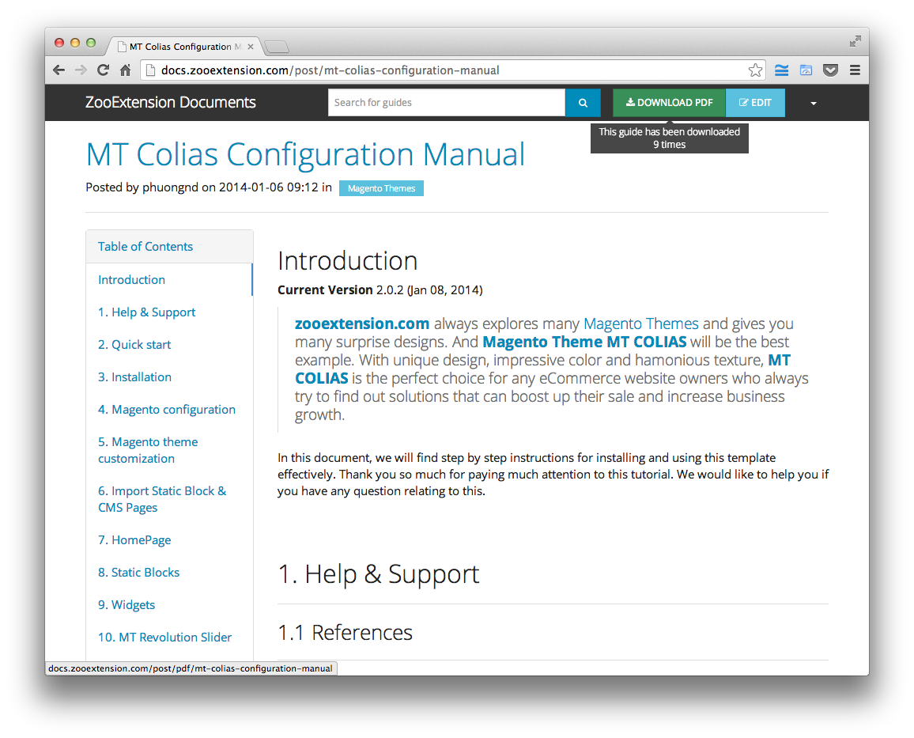
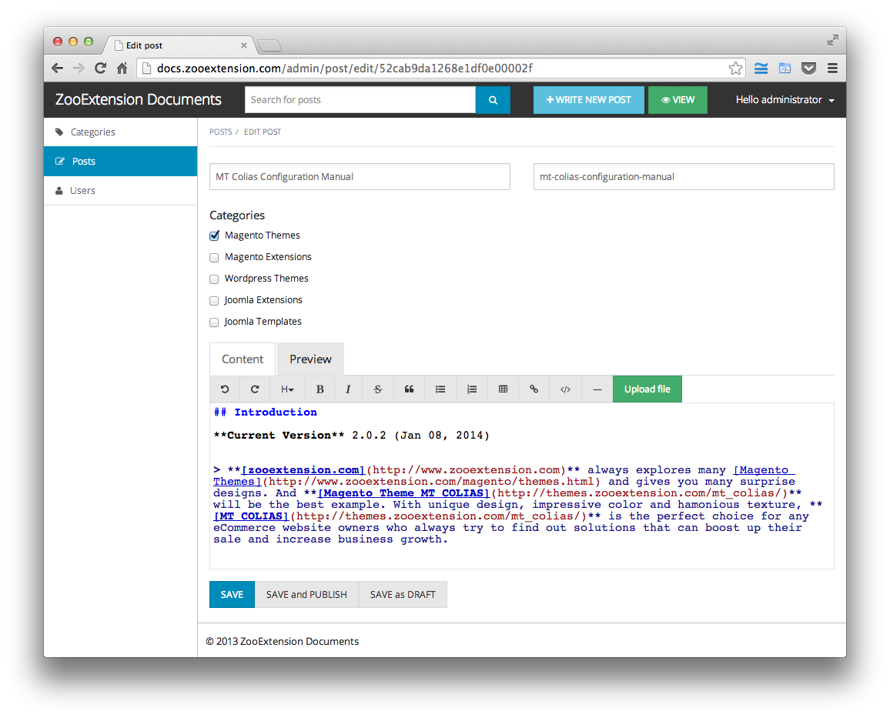

DocWriter
=========

A tool for writing software user guides, written in NodeJs, Express and MongoDB.

It has been using in productions at:

* [ZooTemplate Documents](http://docs.zootemplate.com)
* [ZooExtension Documents](http://docs.zooextension.com)



## Features

**Front-end**

* The guide URLs are friendly (for example, ```http://domain/post/this-is-guide-slug``` instead of ```http://domain/post/52c6613c3320e53e09000003```)
* Generate the table of contents of guide automatically

**Back-end**

* Organize guides by categories. Each post can belong to one or many categories
* Manage users
* Guides are formats in Markdown. Administrators can preview the guide right in the back-end
* The administrator can publish/unpublish guides or save guides as draft one
* The guide is exported to PDF automatically right after saving/publishing it
* Auto save guides after given time. This feature can be enabled/disabled



## Platform

The application is built on top of the following software:

Software                                                | Purpose
--------------------------------------------------------|--------
[MongoDB](http://mongodb.org)                           | Database server
[NodeJS](http://nodejs.org)                             | NodeJS web server
[npm](http://npmjs.org)                                 | Installing NodeJS modules
[Redis](http://redis.io)                                | Storing jobs queue
[wkhtmltopdf](https://github.com/antialize/wkhtmltopdf) | Exporting guides to PDF

In details, it uses [Express](http://expressjs.com) framework in the back-end, and [Bootstrap 3](http://getbootstrap.com) in the front-end.

## Installing

Before going further to steps below, please ensure that the required software are ready on your machine.

Refer to their documentation to see how to install them:

* [Install MongoDB](http://docs.mongodb.org/manual/installation/)
* [Install NPM and NodeJS](https://github.com/joyent/node/wiki/Installing-Node.js-via-package-manager)
* [Install Redis](http://redis.io/topics/quickstart)
* [Install wkhtmltopdf](https://github.com/pdfkit/pdfkit/wiki/Installing-WKHTMLTOPDF)

### Installing NodeJS modules

From the ```src``` directory, execute the command below to install NodeJS modules defined in ```package.json```:

```bash
$ sudo npm install
```

### Preparing the database

From the MongoDB shell, create the database:

```bash
> use docwriter_dev;
```

Then issue the following command to create an administrator account with username as ```administrator```, password as ```admin``` (the password can be changed in the back-end):

```bash
> db.user.insert({
    first_name: 'Administrator', last_name: '', email: 'admin@domain.com',
    hashed_password: '41d4736be7061d0dd826085dd5c5c773c4703e8a', salt: '1000412025288',
    username: 'administrator', role: 'root', locked: false
});
```

Index the collections by the commands:

```bash
> db.category.ensureIndex({ position: 1 });
> db.category.ensureIndex({ slug: 1 });
> db.post.ensureIndex({ slug: 1 });
> db.user.ensureIndex({ email: 1 });
> db.user.ensureIndex({ username: 1 });
```

## Setting

All the app settings are placed in the ```src/config/config.js``` file:

```javascript
...
module.exports = {
    development: {
        root: rootPath
    },
    test: {
        root: rootPath
    },
    production: {
        root: rootPath
    }
};
```

This config file allows you to define settings for different environments such as ```development```, ```test``` and ```production```.
The settings in the ```development``` section should be used in the developing phase.
Meanwhile the production site should use the settings in the ```production``` section.

> You can indicate the environment when running the app via ```NODE_ENV``` variable.
> By default, the app will use the ```development``` settings.

```root```: The root path. Please **DO NOT** change this

```session.domain```: The cookie domain. Don't set it (by either adding ```//``` to the beginning of the line or setting it to empty) if you run app under ```http://localhost:3000```

```session.secret```: A secret string to encrypt the session data.

You can use free online tool for generating random key, such as [RandomKeyGen](http://randomkeygen.com)

```session.lifetime```: The session lifetime in milliseconds

```db```: The MongoDB connection string in the format of ```mongodb://<database server>/<database name>```

```upload.dir```: The path to directory storing uploaded files. __REMEMBER__ to set this directory writable

```upload.url```: This will be prefixed to the URL of uploaded files

```upload.maxSize```: Maximum size of uploaded file in kB.

For example, 1024 * 1024 * 20 allows user to upload files up to 20 MB in size.

```redis.host```: The host of Redis server. It will take ```localhost``` by default

```redis.port```: The port of Redis server, which is ```6379``` by default

```redis.namespace```: Root namespace.

All the Redis keys are combination of the namespace, keys, and colons (```:```). It's used to distinct Redis keys if you run multiple instances of app on the same server, or other websites use the same Redis server.

```autoSave```: The auto-saving interval time in minutes. Set it to 0 to disable auto-saving

```app.url```: The root URL

```app.name```: The name of application. It is used as homepage title

```jobs.exportPdf.command```: The full command of exporting to PDF.

```bash
wkhtmltopdf                             // Path to wkhtmltopdf
    --outline                           // Include table of contents in PDF
    --margin-top 30                     // The margin top value
    --margin-bottom 30                  // The margin bottom value
    --footer-spacing 10                 // The footer spacing value
    --footer-html {footer_template}     // Path to the footer template
    {preview_url}                       // URL of previewing guide (DO NOT change this)
    {pdf_path}                          // Path of output PDF      (DO NOT change this)
```

Of course, you can use other parameters supported by wkhtmltopdf. Take a look at [this document](http://madalgo.au.dk/~jakobt/wkhtmltoxdoc/wkhtmltopdf_0.10.0_rc2-doc.html) for more details.

```jobs.exportPdf.dir```: The directory storing PDF files. __REMEMBER__ to set this directory writable

```jobs.exportPdf.footerTemplate```: The path of PDF footer template.

By default, it is placed at ```src/config/template/pdfFooter.html```

Open this file and change the URL defining CSS styles for the footer to the root URL:

```html
<link rel="stylesheet" href="http://<change to the root URL>/vendor/bootstrap-theme/css/yeti.css">
<link rel="stylesheet" href="http://<change to the root URL>/vendor/font-awesome/css/font-awesome.min.css">
```

```mail```: NodeDesk uses [nodemail](https://github.com/andris9/Nodemailer) to send email, please refer to ```nodemailer``` to config your email relay service. The default configuration makes use of Gmail SMTP service, just simply enter your Gmail's address and password.

## Running

From the ```src``` directory, execute the following commands to run the app and job queues:

```bash
$ node app.js
$ node job.js
```

> The job queues aim to run expensive tasks in the background instead of the browser.
> In this application, these tasks are exporting guides to PDFs

Then access the browser at ```http://localhost:3000```

## Authors

* Author:
Nguyen Huu Phuoc, aka @nghuuphuoc ([Twitter](http://twitter.com/nghuuphuoc) / [Github](http://github.com/nghuuphuoc))

* Contributor:
Nguyen Ta Quang Duc, aka [@ducntq](http://github.com/ducntq)

## License

NodeDesk is written by @nghuuphuoc, and licensed under the MIT license.

```
The MIT License (MIT)

Copyright (c) 2013 - 2014 Nguyen Huu Phuoc

Permission is hereby granted, free of charge, to any person obtaining a copy of
this software and associated documentation files (the "Software"), to deal in
the Software without restriction, including without limitation the rights to
use, copy, modify, merge, publish, distribute, sublicense, and/or sell copies of
the Software, and to permit persons to whom the Software is furnished to do so,
subject to the following conditions:

The above copyright notice and this permission notice shall be included in all
copies or substantial portions of the Software.

THE SOFTWARE IS PROVIDED "AS IS", WITHOUT WARRANTY OF ANY KIND, EXPRESS OR
IMPLIED, INCLUDING BUT NOT LIMITED TO THE WARRANTIES OF MERCHANTABILITY, FITNESS
FOR A PARTICULAR PURPOSE AND NONINFRINGEMENT. IN NO EVENT SHALL THE AUTHORS OR
COPYRIGHT HOLDERS BE LIABLE FOR ANY CLAIM, DAMAGES OR OTHER LIABILITY, WHETHER
IN AN ACTION OF CONTRACT, TORT OR OTHERWISE, ARISING FROM, OUT OF OR IN
CONNECTION WITH THE SOFTWARE OR THE USE OR OTHER DEALINGS IN THE SOFTWARE.
```
